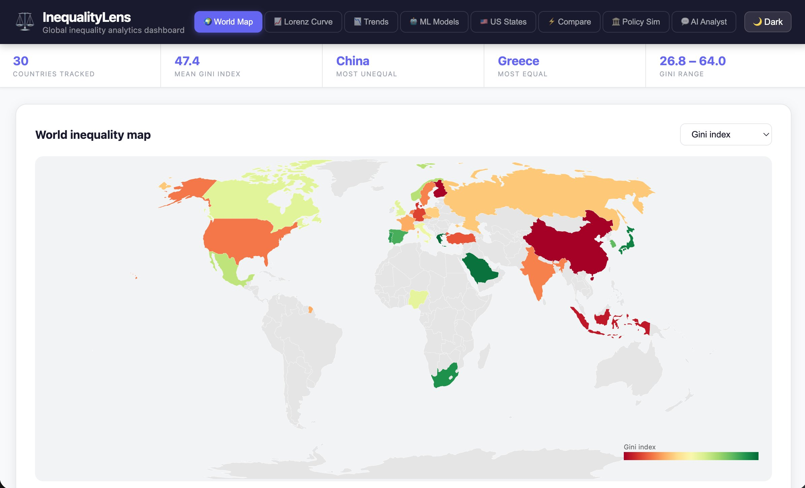

<div align="center">



<br/><br/>

# ⚖️ InequalityLens

### A production-grade data science platform for global inequality analytics

[](https://inequality-lens.vercel.app)
[](https://inequalitylens.onrender.com/docs)
[](https://github.com/praneethcheturi-143/InequalityLens)


</div>

---

## 🎯 What is this?

InequalityLens pulls **live data** from the World Bank API, US Census ACS, and WHO across 30+ countries, processes it through a Python ETL pipeline, trains ML models on top, and serves everything through a FastAPI backend and a React dashboard with 8 interactive modules.

> Built to demonstrate the complete data science stack — from raw API calls to a deployed ML-powered product that works right now.

---

## 🚀 8 Interactive Modules

| Module | Description | Tech |
|--------|-------------|------|
| 🌍 **World Map** | Choropleth — Gini, GDP, life expectancy, poverty | D3.js, GeoJSON |
| 📈 **Lorenz Curve** | Multi-country income distribution comparison | Recharts, NumPy |
| 📉 **Trends** | Gini history + Ridge regression forecast (1–15yr) | scikit-learn |
| 🤖 **ML Models** | RF predictor + permutation importance + KMeans | scikit-learn |
| 🇺🇸 **US States** | State income & poverty from Census ACS 2022 | Pandas, Recharts |
| ⚡ **Compare** | Radar chart across 6 dimensions for 4 countries | Recharts RadarChart |
| 🏛️ **Policy Sim** | 5 policy levers → predicted Gini/poverty/GDP impact | ML regression |
| 💬 **AI Analyst** | Natural language Q&A on inequality data | NLP |

---

## 🏗️ Architecture

```
┌─────────────────────────────────────────────────────────┐
│            React 18 Frontend (Vercel)                    │
│   D3 choropleth · Recharts · dark mode · responsive     │
└───────────────────┬─────────────────────────────────────┘
                    │ REST API (JSON)
┌───────────────────▼─────────────────────────────────────┐
│               FastAPI Backend (Render)                   │
│   14 endpoints · Pydantic v2 · Swagger docs · CORS      │
└──────┬──────────────────┬──────────────────┬────────────┘
       │                  │                  │
┌──────▼──────┐  ┌────────▼───────┐  ┌──────▼──────────┐
│ ETL Pipeline │  │   ML Service   │  │  Data Service   │
│ World Bank   │  │ Random Forest  │  │ CSV/Parquet     │
│ Census ACS   │  │ KMeans         │  │ LRU cache       │
│ Lorenz calc  │  │ Ridge forecast │  │ auto-pipeline   │
└─────────────┘  └────────────────┘  └─────────────────┘
```

---

## 🤖 ML Models

<details>
<summary><b>Random Forest Gini Predictor — R² = 0.78</b></summary>

Predicts a country's Gini index from 5 socioeconomic features.

| Feature | RF Importance | Permutation Importance |
|---|---|---|
| GDP per capita | 35% | 32% |
| Adult literacy | 28% | 25% |
| Life expectancy | 18% | 20% |
| Poverty rate | 12% | 14% |
| Health expenditure | 7% | 9% |

</details>

<details>
<summary><b>KMeans Country Clustering — 4 profiles</b></summary>

Groups countries into: High inequality/low development · Low inequality/high development · Middle income · Emerging high poverty

</details>

<details>
<summary><b>Ridge Regression Gini Forecasting</b></summary>

Per-country time series regression. Outputs trend direction, slope, R² fit, and 1–15 year forecasts.

</details>

<details>
<summary><b>Policy Impact Simulator</b></summary>

Linear regression ensemble mapping 5 policy levers to predicted Gini, poverty, GDP, and life expectancy changes.

</details>

---

## 📡 API Endpoints

| Method | Endpoint | Description |
|--------|----------|-------------|
| `GET` | `/api/summary` | Global stats — mean Gini, most/least unequal |
| `GET` | `/api/choropleth` | All countries with all metrics |
| `GET` | `/api/country/{code}` | Single country + full Gini history |
| `GET` | `/api/lorenz?country=Brazil` | Lorenz curve (101 points) |
| `GET` | `/api/gini-timeseries?country_code=USA` | Historical Gini 1990–2023 |
| `GET` | `/api/clusters` | KMeans country clusters |
| `GET` | `/api/feature-importance` | RF + permutation importance |
| `GET` | `/api/us-states` | Census ACS state data |
| `POST` | `/api/predict/gini` | Predict Gini from custom features |
| `POST` | `/api/forecast` | Forecast Gini trend |
| `POST` | `/api/train` | Retrain all models |
| `GET` | `/docs` | Interactive Swagger explorer |

---

## 🛠️ Tech Stack

**Backend:** Python 3.11 · FastAPI · Pandas · NumPy · scikit-learn · Pydantic v2 · Joblib

**Frontend:** React 18 · D3.js v7 · Recharts · topojson-client · CSS variables

**Data:** World Bank API · US Census ACS 2022 · WHO / Our World in Data

**DevOps:** Docker · docker-compose · Render · Vercel · CI/CD from GitHub

---

## ⚡ Run Locally

```bash
# Clone
git clone https://github.com/praneethcheturi-143/InequalityLens
cd InequalityLens

# Backend
cd backend && pip install -r requirements.txt
cd ../data && python data_pipeline.py
cd ../backend && uvicorn main:app --reload --port 8000
# → http://localhost:8000/docs

# Frontend
cd frontend && npm install
REACT_APP_API_URL=http://localhost:8000 npm start
# → http://localhost:3000

# Docker
docker-compose up --build
```

---

## 📁 Project Structure

```
InequalityLens/
├── backend/
│   ├── main.py                  # FastAPI app
│   ├── api/routes.py            # 14 REST endpoints
│   ├── models/schemas.py        # Pydantic schemas
│   └── services/
│       ├── data_service.py      # Data loading + LRU cache
│       └── ml_service.py        # RF, KMeans, Ridge, SHAP
├── data/
│   ├── data_pipeline.py         # ETL pipeline
│   └── processed/               # CSV outputs
├── notebooks/
│   └── eda_analysis.ipynb       # 6-section EDA
├── assets/
│   └── dashboard.png
└── frontend/
    └── src/
        ├── components/          # 9 React components
        ├── hooks/useAPI.js
        └── utils/api.js
```

---

## ✅ Skills Demonstrated

`Python ETL` · `REST API integration` · `Pandas` · `NumPy` · `Gini/Lorenz computation` · `Random Forest` · `KMeans` · `Ridge regression` · `Cross-validation` · `Permutation importance` · `D3.js choropleth` · `Recharts` · `FastAPI` · `Pydantic` · `React 18` · `Dark mode` · `Docker` · `Render` · `Vercel` · `CI/CD`

---

<div align="center">

**Built by [Praneeth Cheturi](https://github.com/praneethcheturi-143)**

[](https://inequality-lens.vercel.app)

</div>
